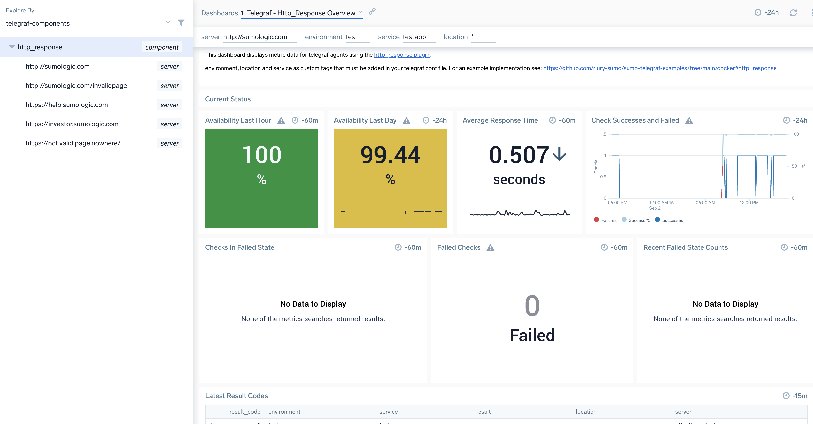

# docker telegraf
Docker images based on https://github.com/influxdata/influxdata-docker
The origional exposes ports which would restrict to one running container per host potentially without jiggery pokery.
In this project we will also include example telegraf.conf files with env vars to make configuration launch more dynamic.

## build
```
docker build -t sumo_telegraf_agent .
```
## setup and run
make sure when you execute the container you have a valid conf file.
you can use one of the templates in ./conf as these are copied to image or supply your own.

```
docker run -it -e SUMO_URL="$SUMO_URL"  -e env=test sumo_telegraf_agent telegraf --config ping.conf
docker run -it -e SUMO_URL="$SUMO_URL"  -e env=test -e urls='invalid.host' sumo_telegraf_agent telegraf  --config ping.conf
docker run -it -e SUMO_URL="$SUMO_URL"  -e env=uat -e urls='http://sumologic.com' sumo_telegraf_agent telegraf  --config http_response.conf
docker run -it -e SUMO_URL="$SUMO_URL"  -e env=prod -e urls='http://sumologic.com' -e location=living_room sumo_telegraf_agent telegraf  --config http_response.conf

```


## global tags
Posts to sumo with:
_sourcecategory=metrics/telegraf
_sourcehost=hostname
ip=container ip

## env vars
runtime container variables allow you to run potentially multiple container instaces with custom config.
Default values for env vars are defined in entrypoint.sh

### Env vars mandatory for all configs
- SUMO_URL 

### env vars optional for all configs:
- X_SUMO_FIELDS
- env
- service
- location

## ping component=ping
Containerised synthetic ping check as per: https://github.com/influxdata/telegraf/tree/master/plugins/inputs/ping

### env vars
- urls - hosts to send ping packets to

### example explore node
see: explore/hr-example.json or explore/telegraf-components.json

### example dashboard with stack link 
see: complete-apps/ping


## http_response component=http_response
Containerised synthetic ping check as per: https://github.com/influxdata/telegraf/tree/master/plugins/inputs/http_response

### env vars
- urls - hosts to poll via http

### example explore node
see: explore/hr-example.json or explore/telegraf-components.json

### example dashboard with stack link 
see: complete-apps/http_response




