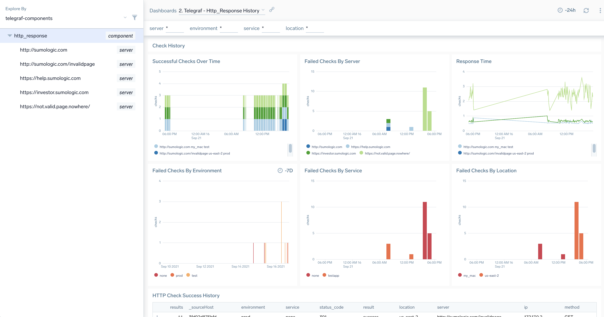

# docker telegraf
Docker images based on https://github.com/influxdata/influxdata-docker to send SumoLogic output plugin metrics using the telegraf input plugins for synthetic tests:
- ping
- http_response

Note: the dockerfile is very similar but disables the exposed ports which would restrict to one running container per host. We don't need influxdb since we are using the sumo output plugin.

In this project we will also include example telegraf.conf files with env vars to make configuration launch more dynamic so it's ready to go in an enterprise environment.

## build
```
docker build -t sumo_telegraf_agent .
```

## docker hub
Container image ready to use at:
https://hub.docker.com/repository/docker/rickjury/sumo-telegraf-agent/general

for example:
```rickjury/sumo-telegraf-agent:latest```

## setup and run
make sure when you execute the container you have a valid conf file.
you can use one of the templates in ./conf as these are copied to image or supply your own.

For other examples to orchestrate container see: docker/orchestration

```
docker run -it -e SUMO_URL="$SUMO_URL"  -e env=test -e urls='invalid.host' sumo_telegraf_agent telegraf  --config ping.conf
docker run -it -e SUMO_URL="$SUMO_URL"  -e env=uat -e urls='http://sumologic.com' sumo_telegraf_agent telegraf  --config http_response.conf
docker run -it -e SUMO_URL="$SUMO_URL"  -e env=prod -e urls='http://sumologic.com,https://support.sumologic.com' -e location=living_room sumo_telegraf_agent telegraf  --config http_response.conf
```

## global tags
Posts to sumo with:
```
_sourcecategory=metrics/telegraf
_sourcehost=<container hostname>
ip=<ontainer <ontainer ip address>
```

## env vars
runtime container variables allow you to run potentially multiple container instaces with custom config.
Default values for env vars are defined in entrypoint.sh

### Env vars mandatory for all configs
- SUMO_URL 

### env vars optional for all configs:
This container is designed to send some extra contextual information with the default metric dimensions.

Typically with synthetic checks we would want to add additional dimensions such as:
- X_SUMO_FIELDS: any arbitrary commas separated list of fields.
- env: sends a tag called environment to sumo
- service: the service name for grouping endpoints
- location: the location the dockerised test is run from. Useful if you want to test from multiple source locations.

### env vars for check intervals
Interval can be supplied as vars, defined in entrypoint.sh as below:
```
export interval=${interval:='60s'}
export flush_interval=${flush_interval:='60s'}
```

## ping
```
component=ping
```
Containerised synthetic ping check as per: https://github.com/influxdata/telegraf/tree/master/plugins/inputs/ping

### env vars
- urls - hosts to send ping packets to. to define multiple hosts supply as csv list for example: ```a,b,c```

### example explore node
see: explore/hr-example.json or explore/telegraf-components.json

### example dashboard with stack link 
see: complete-apps/ping


## http_response 
```
component=http_response
```

Containerised synthetic http check as per: https://github.com/influxdata/telegraf/tree/master/plugins/inputs/http_response

For a simple example of running this container to poll several sites every minute via kubernetes see: docker/orchestration/docker-k8s/pod.yaml

### env vars
- urls - hosts to poll via http. to define multiple hosts supply as csv list for example: ```http://a.b.c,https://b.c.d```

### example explore node
see: explore/hr-example.json or explore/telegraf-components.json

### dashboard for single or multiple nodes


### example dashboard with stack link 
see: complete-apps/http_response





## statsd 
```
component=statsd
```
Listens for statsd or datatog statsd metrics on UDP 8125 and forwards in prometheus format to sumo.
https://github.com/influxdata/telegraf/tree/master/plugins/inputs/statsd

** you must expose UDP 8125 or the container will fail to start **

To start the container:
```
docker run -it -p 8125:8125/udp -e SUMO_URL="$SUMO_URL"  -e env=prod -e location=dc1 rickjury/sumo-telegraf-agent telegraf  --config statsd.conf
```

To test metrics is working:
- open shell in the running container.
```
echo -n "custom_metric:60|g|#shell" >/dev/udp/localhost/8125
```
- metrics would be visible in sumo with: component=statsd metric=custom_metric_value 

### env vars
- note default flush interval in entrypoint.sh You might want to use custom interval. Similar to statsd forwarded metrics are aggregated.


