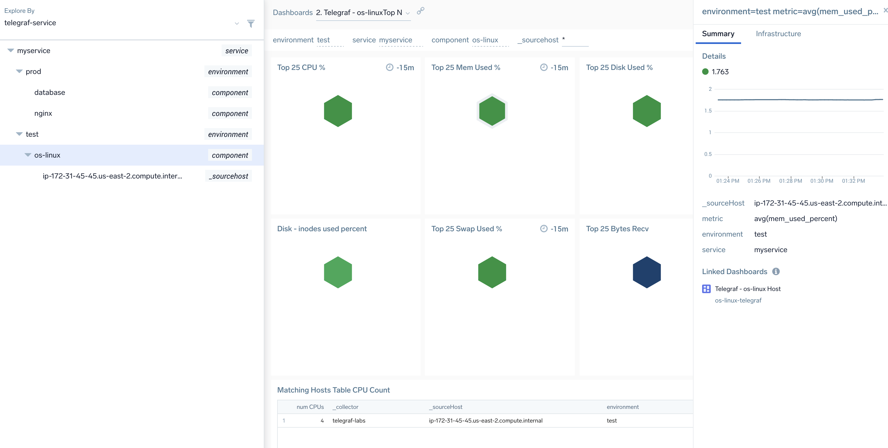
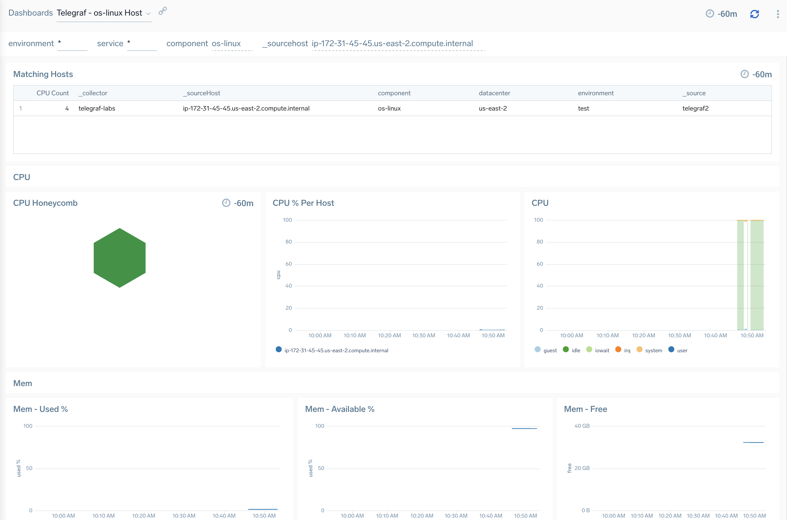
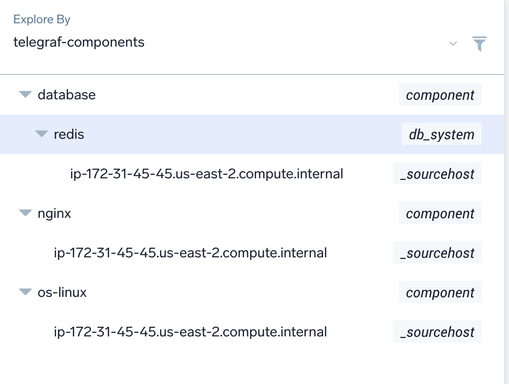
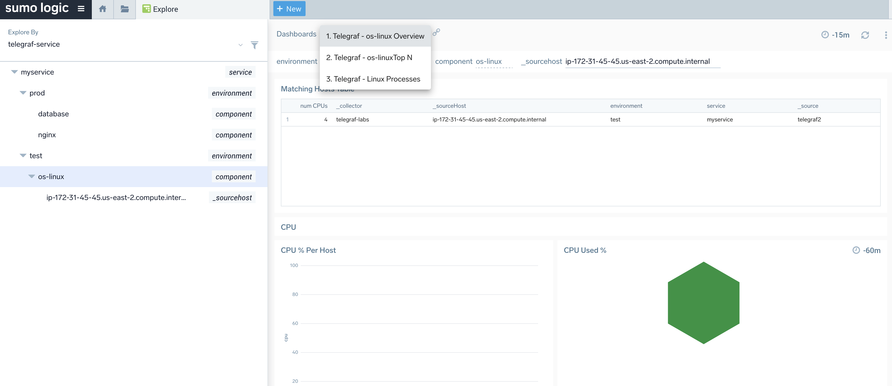
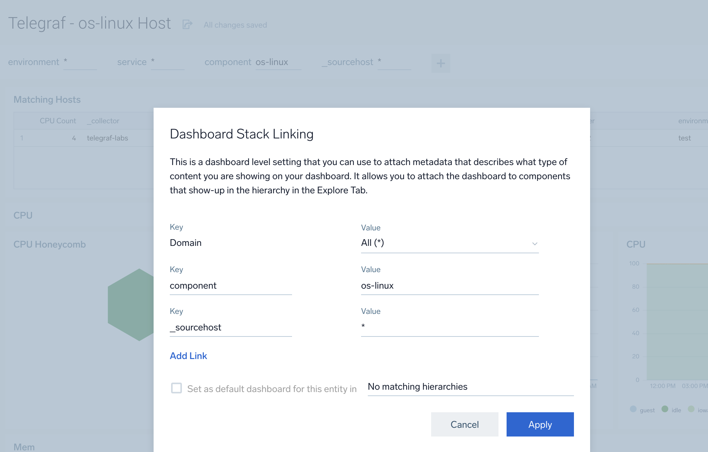
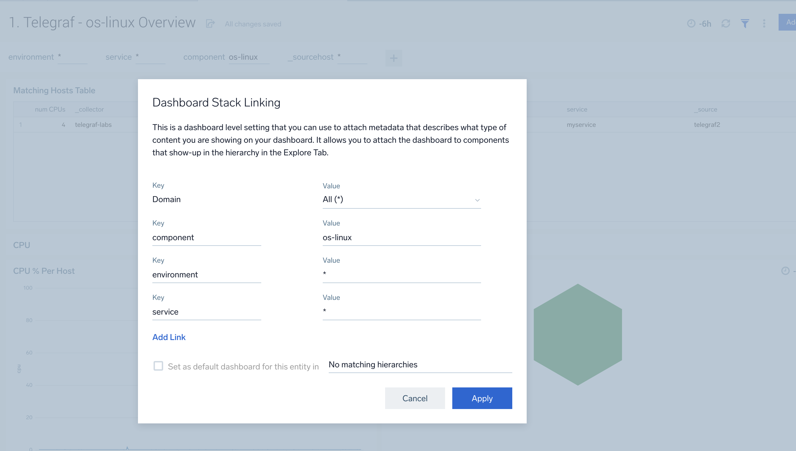

# Linux observability demo for Sumo Logic Using Telegraf



<!-- vscode-markdown-toc -->
* 1. [Overview](#Overview)
	* 1.1. [highlights](#highlights)
* 2. [Design Considerations](#DesignConsiderations)
	* 2.1. [collection](#collection)
	* 2.2. [sumo metadata in the telegraf.conf](#sumometadatainthetelegraf.conf)
	* 2.3. [Tagging As a Basic of Hierarchy In Explore](#TaggingAsaBasicofHierarchyInExplore)
		* 2.3.1. [global tags](#globaltags)
		* 2.3.2. [input level tags](#inputleveltags)
	* 2.4. [Hierarchy](#Hierarchy)
	* 2.5. [Data Points Per Minute (DPM) and Credits Consumption](#DataPointsPerMinuteDPMandCreditsConsumption)
	* 2.6. [Process level metrics procstat plugin](#Processlevelmetricsprocstatplugin)
* 3. [Setup](#Setup)
	* 3.1. [Collection](#Collection)
	* 3.2. [telegraf install](#telegrafinstall)
* 4. [telegraf configuration](#telegrafconfiguration)
	* 4.1. [output url](#outputurl)
	* 4.2. [tags](#tags)
* 5. [importing demo app](#importingdemoapp)
* 6. [build a hierarchy](#buildahierarchy)
		* 6.1. [Custom hierarchy by component tag](#Customhierarchybycomponenttag)
		* 6.2. [Custom hierarchy by business tags: service/environment/component](#Customhierarchybybusinesstags:serviceenvironmentcomponent)
	* 6.1. [Stack Linking](#StackLinking)
		* 6.1.1. [stack linking to entities](#stacklinkingtoentities)
		* 6.1.2. [stack linking to higher level nodes such as environment.](#stacklinkingtohigherlevelnodessuchasenvironment.)
* 7. [Integrating Existing Content Into the New Hierarchy Tree](#IntegratingExistingContentIntotheNewHierarchyTree)
	* 7.1. [Walkthrough - convert the redis overview dasbhoard to work with the new hierarchy](#Walkthrough-converttheredisoverviewdasbhoardtoworkwiththenewhierarchy)
		* 7.1.1. [fix up the stack linking.](#fixupthestacklinking.)
	* 7.2. [Creating a redis _sourcehost node dashboard](#Creatingaredis_sourcehostnodedashboard)

<!-- vscode-markdown-toc-config
	numbering=true
	autoSave=true
	/vscode-markdown-toc-config -->
<!-- /vscode-markdown-toc -->


##  1. <a name='Overview'></a>Overview
This is a very rough demo project to show how we can:
- use telegraf to collect and forward base level metrics to sumo for disk, cpu, mem
- monitor per process with procstat plugin
- create a custom [Explore](https://help.sumologic.com/Visualizations-and-Alerts/Explore) hierarchy using telegraf metrics or custom metric tag dimensions such as environment or service name.
- add custom stack linked dashboards to the explore tree
- create example alerts.

###  1.1. <a name='highlights'></a>highlights
- example linux telegraf host config [here](./config/linux.telegraf.conf). The template includes key plugins for linux with some config tweaks to provide a good OOTB starting config that balances metric choices vs DPM.

You can also find in here an example of per process metrics collection with procstat.
- a [script to create a custom heirarchy by telegraf component](explore/new-hr-os-nginx-redis.py)
- a [script to create a custom hierarchy by custom tags](explore/new-hr.py)
- a [linux host level dashboard](dashboards/1-linux-host.json) for telegraf template
- a [process monitoring dashbboard](dashboards/3-linux-processes.json) for the procstat plugin
- a l[inux overview showing top n disk, cpu, memory](dashboards/2-linux-top-n.json) for the telegraf metrics. this is stack linked to a custom hierarchy (service, environment,component)

##  2. <a name='DesignConsiderations'></a>Design Considerations

###  2.1. <a name='collection'></a>collection
Metrics will be streamed in prometheus format to sumo HTTPS source using the sumologic output plugin. This is standard to [integrating telegraf into Sumo](https://help.sumologic.com/03Send-Data/Collect-from-Other-Data-Sources/Collect_Metrics_Using_Telegraf). 

###  2.2. <a name='sumometadatainthetelegraf.conf'></a>sumo metadata in the telegraf.conf
- _collector and _source will represent the hosted collection endpoints
- sourcecategory: set to 'metrics/telegraf'.  
A real world telegraf implmentation could have many sources included in a telegraf.conf file, so by keeping the sourcecategory generic we ensure telegraf sourced metrics are easily identified in sumo.
- sourceHost: telegraf sends a 'host' tag but we will also send _sourcehost correctly for consistency on sumo side.
```
  source_host = "${HOSTNAME}"
  source_category = "metrics/telegraf"
```

###  2.3. <a name='TaggingAsaBasicofHierarchyInExplore'></a>Tagging As a Basic of Hierarchy In Explore
We need a consistent and generic metric tag scheme to enable reporting in sumo by key dimensions, and to build a custom heirarchy in explore.
Each metric set sent should have a 'component' tag set that will be the primary method to group telegraf metrics sent.

The actual tags used could vary between customer environments but should include things like:
- environment
- application / service name
- datacenter or cloud provider
- technical/business or budget owners.

####  2.3.1. <a name='globaltags'></a>global tags
This example has hardcoded tags but best practice would be to set these as environment variables instead. See the user row as an example:
```
[global_tags]
    component="os-linux"
    environment="test"
    datacenter="us-east-2"
    service="myservice"
    user = "${USER}"
```
####  2.3.2. <a name='inputleveltags'></a>input level tags
example using redis input
```
    [inputs.redis.tags]
    environment="prod"
    component="database"
    db_system="redis"
    db_cluster="redis_prod_cluster01"
```

###  2.4. <a name='Hierarchy'></a>Hierarchy
[Explore](https://help.sumologic.com/Visualizations-and-Alerts/Explore) is a navigation tool that provides an intuitive visual hierarchy of your environment. Use Explore to facilitate successful monitoring, managing, and troubleshooting.  OOTB sumo provides explore integrations for AWS, Kubentetes & distributed tracing.

This can be extended to have a cusotm hierarchy but this must be done via API - but we need a tagging scheme that is consistent (see tags prior topic!) as a base for the hierarchy.

We can use the explorer API to create one or more custom heirarchies for example:
- environment / service / component
- service / environment / component
- telegraf by component
and so on.

So for example the 'component' level might include things like:
- os-linux
- database
- nginx
and any other telegraf plugins we want to integrate into sumo and the heirarchy tree.


Note: users could additionally use the filters feature in explore to search by any tags applied see [filter explore](https://help.sumologic.com/Visualizations-and-Alerts/Explore/Filter_Explore).

###  2.5. <a name='DataPointsPerMinuteDPMandCreditsConsumption'></a>Data Points Per Minute (DPM) and Credits Consumption
Sumo metrics is a volume based charging model on DPM (Data Points Per Minute) which might say consume 3 credits per 1000 DPM averaged over 1 day. 

This means more DPM will consume more credits - so choosing more telegraf metrics, polling more often and more fields combinations will increase the DPM count.

Let's look at this in more detail:
1. more frequent data points generate more DPM. To configure use the interval/flush interval. 
Pay close attentin to what settings you are using for 
  interval = "15s"
  flush_interval = "15s"
More frequent metrics will result in higher granulaity but higher DPM consumption per host.
Less frequent metric data poinst (say every 1m or 2m) will reduce DPM consumption per host.

2. number of metric series/tag/fields. Use namepass / fieldpass / fielddrop etc to restrict collected metrics to only useful ones.
You will find many examples of this in the linux template for example:
```
[[inputs.diskio]]
  fieldpass = ["*_time","*bytes"]
```

3. tag cardinality: be careful of tags that introduce higher cardinality as this will result in more DPM if there are many permutations over a short time range.

###  2.6. <a name='Processlevelmetricsprocstatplugin'></a>Process level metrics procstat plugin
procstat plugin provides per host metrics.
It's recommended to monitor only specific processes this way as you will get multiple dpm per process per host, and there can be **hundreds of running processes** on a single host!

The template includes an example config to monitor java processes on a host. The config below:
- includes processes with java in the regex pattern
- does not include cmdline tag (this will be too long in many cases for the sumo tag character limit)
- pid - is added as a tag to make it easier to distinguish on sumo side per instance/process
- fieldpass limits metrics collected to a sensible middle ground for DPM.

```
[[inputs.procstat]]
  pattern = "java"
  cmdline_tag = false
  pid_tag = true
  fieldpass = ["cpu_usage","cpu_time","memory_usage","pid","memory_swap","*bytes","num_threads"]
```
##  3. <a name='Setup'></a>Setup

###  3.1. <a name='Collection'></a>Collection
Create a hosted collector and HTTPS Source as per [configure sumo output plugin](https://help.sumologic.com/03Send-Data/Collect-from-Other-Data-Sources/Collect_Metrics_Using_Telegraf/05_Configure_Telegraf_Output_Plugin_for_Sumo_Logic) and note the url for later!

###  3.2. <a name='telegrafinstall'></a>telegraf install
See: https://help.sumologic.com/03Send-Data/Collect-from-Other-Data-Sources/Collect_Metrics_Using_Telegraf/03_Install_Telegraf#install-telegraf-in-a-non-kubernetes-environment

##  4. <a name='telegrafconfiguration'></a>telegraf configuration
Use the supplied [config/linux.telegraf.conf](config/linux.telegraf.conf)] example as a start point. This includes the typical linux host plugins to get us coverage of:
- disk
- cpu
- memory
- swap
- diskio
- system (uptime etc)
- process count
- procstat - provides example of per process montioring.

You can also find some examples for nginx or redis plugins. You can add any other plugins just consider up from what component value you will use and how stack linking might be achieved.

###  4.1. <a name='outputurl'></a>output url
Make sure to set SUMO_URL environment variable to match the https source you created earlier. for example:
```
export SUMO_URL="https://abcdefg"
```

###  4.2. <a name='tags'></a>tags
Note that we have a global tag component="os-linux"
Set global and/or input level tags to match the hierarchy levels that you want to use in your organization. 
It's recommended to use environment variables or a code pipeline to parameterize these to avoid hardcoding them in your configuration file.

Such as:
```
    component="os-linux"
    environment="test"
    datacenter="us-east-2"
    service="myservice"
    user = "${USER}"
```

##  5. <a name='importingdemoapp'></a>importing demo app
You can find a complete demo app set of dashboards [here](complete-app/telegraf.json)

This includes examples of generic dashboards for base components as well as stack linked higher level dashboards to link to a service/environment/component hierarchy.

See this article if you are not familiar with how to [import content](https://help.sumologic.com/05Search/Library/Export-and-Import-Content-in-the-Library).

##  6. <a name='buildahierarchy'></a>build a hierarchy 
Once you have decided on a heirarchy and made sure the metrics collected have matching tag dimensions configured we can build one more heirarchies using the explore API. There are various ways to structure a heirarchy you can see examples of different approaches in this file [hr-all.demo.json](./explore/hr-all-demo.json) This is a get of all standard sumo hierarchy types from a demo org.

####  6.1. <a name='Customhierarchybycomponenttag'></a>Custom hierarchy by component tag
We can build a hierarchy 1 level deep to show content for each telgraf plugin that is integrated.

If you refer to [hr-os-nginx-redis.json](explore/hr-os-nginx-redis.json) you will see we can show each new component as a level, then have a dynamic list of all nodes in the that level with something like this:
```
{
    "name": "telegraf-components",
    "level": {
        "entityType": "component",
        "nextLevelsWithConditions": [
            {
                "condition": "os-linux",
                "level": {
                    "entityType": "_sourcehost",
                    "nextLevelsWithConditions": [],
                    "nextLevel": null
                }
            },
```

Use a API call to upload the new hierarchy similar to the new-hr.py scripts in ./explore.


####  6.2. <a name='Customhierarchybybusinesstags:serviceenvironmentcomponent'></a>Custom hierarchy by business tags: service/environment/component
If you refer to the [hr-example.json](./explore/hr-example.json) you will see we can create a heirarchy that includes some of our business level tags (such as application or environment), then split out the compoents with a node for each component type such as os-linux.



###  6.1. <a name='StackLinking'></a>Stack Linking 
Once you have built your hierarchy you can work on stack linking custom content. 
Two example hierarchies and upload scripts can be found in the ./explore folder.

####  6.1.1. <a name='stacklinkingtoentities'></a>stack linking to entities
Ideally we would start with base level node home dashbaord say for a linux host or database instance. This should be stack linked to the lowest level such as _sourcehost. Here is an example [linux home page](dashboards/1-linux-host-overview.json) for any os-linux component instance.

Next you can create more high level views to stack to higher levels of the hierarchy. For example the [topn](dashboards/2-linux-top-n.json) will show just the highest cpu nodes , fullest disk volumes etc.

This can then be [stack linked](https://help.sumologic.com/Visualizations-and-Alerts/Dashboard_(New)/Link_a_dashboard_to_Explore) to the component level.

An example is this dashboard: [dashboards/1-linux-host.json](dashboards/1-linux-host.json) which is a generic linux host dashboard to use as a home page for a single os-linux entity.

####  6.1.2. <a name='stacklinkingtohigherlevelnodessuchasenvironment.'></a>stack linking to higher level nodes such as environment.
You can then build and stack link higher level views that might show say per service or per environment summaries for all components you are deploying.

At higher levels of the tree we can stack link other custom dashboards such as at the 'top n' dashboard linked to os-linux component level that shows top usage of disk cpu etc across all os-linux nodes. [dashboards/2-linux-top-n.json](dashboards/2-linux-top-n.json)

Stack linking is done via the UI or by updating the JSON for the dashboard.





Note - you can't always stack link a single type of dashboard to multiple levels of a multi level hierarchy so you might need to create duplicates of the same dashboard with different stack link values.


##  7. <a name='IntegratingExistingContentIntotheNewHierarchyTree'></a>Integrating Existing Content Into the New Hierarchy Tree
Some sumo apps already exist for various telegraf plugins but they might not work out of the box with our new hierarchy. This is because the template parameters have to match exactly the names we use to map out each hierarchy level. 

So for example for redis if we are using this:
```
{
                "condition": "database",
                "level": {
                    "entityType": "db_system",
                    "nextLevelsWithConditions": [{
                        "condition": "redis",
                        "level": {
                            "entityType": "_sourcehost",
                            "nextLevelsWithConditions": [],
                            "nextLevel": null
                        }
                    }],
                    "nextLevel": null
                }
            }       
```

We need to modify the sumo app dashboards to use these template variables:
- component=redis
- db_system=redis
- _sourcehost

Let's work through fixing up some of the redis content.

###  7.1. <a name='Walkthrough-converttheredisoverviewdasbhoardtoworkwiththenewhierarchy'></a>Walkthrough - convert the redis overview dasbhoard to work with the new hierarchy

First go to app catalog and import the app into your library folder as a new version with a new name.

On the import screen make surce to use 
```component=database db_system=redis``` as the filter.

Now export the json of a dashbooard you want to fix up and let's get to work!

#### fixing host to _sourcehost param
metrics have a host value but logs have a _sourcehost. Earlier you might have noticed we tweaked the template to also send a _sourcehost value so we have a common host name across both.

in the redis-overview we start with this 
```
        {
            "id": null,
            "name": "host",
            "displayName": "host",
            "defaultValue": "*",
            "sourceDefinition": {
                "variableSourceType": "MetadataVariableSourceDefinition",
                "filter": "metric=redis* db_system=redis component=database db_cluster={{db_cluster}}",
                "key": "host"
            },
            "allowMultiSelect": false,
            "includeAllOption": true,
            "hideFromUI": false
        }
```

update this to:
```
        {
            "id": null,
            "name": "_sourcehost",
            "displayName": "_sourcehost",
            "defaultValue": "*",
            "sourceDefinition": {
                "variableSourceType": "MetadataVariableSourceDefinition",
                "filter": "_sourcecategory=metrics/telegraf metric=redis*",
                "key": "_sourcehost"
            },
            "allowMultiSelect": false,
            "includeAllOption": true,
            "hideFromUI": false
        }
```

#### fixing sourcehost in panels
Right now the query panels would be something like this:
```
"queryString": " db_cluster={{db_cluster}} host={{host}} component=database db_system=redis  metric=redis_keyspace_hitrate | avg by host",
```

do a global replace to replace in all panels 
```host={{host}} ``` with ```_sourcehost={{_sourcehost}} ```

####  7.1.1. <a name='fixupthestacklinking.'></a>fix up the stack linking.
Say we want this overview to appear at the componet redis level in the tree we would update the
```
    "topologyLabelMap": {
        "data": {
            "component": [
                "database"
            ],
            "db_system": [
                "redis"
            ]
        }
    },
```

###  7.2. <a name='Creatingaredis_sourcehostnodedashboard'></a>Creating a redis _sourcehost node dashboard
We also need a host level redis home page dashboard for metrics.

Let's pick the 'Redis - Cluster Operations' dash and convert that.

Once again:
- update the host to _sourcehost parameter block
- do a global replace to replace in all panels 
```host={{host}} ``` with ```_sourcehost={{_sourcehost}} ``` 

this time stack link to the specific lowerlevel of the tree for any sourcehost.
```
    "topologyLabelMap": {
        "data": {
            "component": [
                "database"
            ],
            "db_system": [
                "redis"
            ],
            "_sourcehost": [
                "*"
            ]
        }
    },
```